# Анализ информационной системы

## 1. Описание системы

Название: Tilda

Ссылка: https://tilda.ru/

Назначение:
Tilda — облачный конструктор сайтов, предназначенный для создания, редактирования и публикации веб-страниц без
необходимости самостоятельной разработки всей программной инфраструктуры.

Целевая аудитория:

- Частные пользователи, создающие личные сайты и портфолио.
- Предприниматели и владельцы малого бизнеса.
- Дизайнеры и веб-разработчики.
- Маркетологи и специалисты по продвижению.
- Компании, создающие корпоративные сайты и лендинги.

Основные возможности:

- Создание веб-страниц с использованием готовых блоков.
- Редактирование текстов, изображений и других элементов страницы.
- Настройка внешнего вида сайта.
- Создание многостраничных сайтов.
- Публикация сайтов в интернете.
- Добавление форм обратной связи и других функциональных элементов.
- Подключение доменов.
- Управление проектами и страницами через личный кабинет.

Выбранный сценарий:
Добавление блока на страницу в редакторе.

В рамках сценария пользователь открывает редактор страницы, выбирает подходящий блок из библиотеки, добавляет его на
страницу и проверяет результат.

## 2. Анализ пользовательского интерфейса

### 2.1. Основные страницы и разделы

В рамках лабораторной работы исследуется информационная система Tilda — облачный конструктор сайтов.

В системе используются следующие основные страницы и разделы:

- Главная страница Tilda.
- Страница авторизации.
- Личный кабинет пользователя.
- Список проектов.
- Страница управления проектом.
- Список страниц проекта.
- Редактор страницы.
- Библиотека готовых блоков.
- Компонент публикации сайта.
- Настройки проекта и страницы.

Часть разделов, включая личный кабинет, список проектов и редактор страниц, доступна только после авторизации
пользователя.

### 2.2. Ключевые элементы интерфейса

| Элемент интерфейса             | Назначение                                        |
|--------------------------------|---------------------------------------------------|
| Логотип Tilda                  | Переход на главную страницу или в личный кабинет  |
| Главное меню                   | Навигация между основными разделами системы       |
| Личный кабинет                 | Управление проектами и страницами пользователя    |
| Список проектов                | Просмотр и выбор созданных проектов               |
| Список страниц                 | Просмотр страниц выбранного проекта               |
| Кнопка создания страницы       | Добавление новой страницы в проект                |
| Кнопка редактирования страницы | Открытие страницы в редакторе                     |
| Рабочая область редактора      | Отображение структуры и содержимого страницы      |
| Кнопка добавления блока        | Открытие библиотеки готовых блоков                |
| Библиотека блоков              | Выбор готового блока для добавления на страницу   |
| Категории блоков               | Фильтрация блоков по назначению и типу            |
| Карточка блока                 | Предварительный просмотр и выбор блока            |
| Панель настроек блока          | Изменение параметров выбранного блока             |
| Панель редактирования блока    | Изменение контента (содержимого) выбранного блока |
| Кнопка публикации              | Размещение страницы в интернете                   |

### 2.3. Выполнение пользовательского сценария

Выбранный сценарий: добавление блока на страницу в редакторе Tilda.

Для выполнения сценария использовался учебный проект в личном кабинете Tilda.

Последовательность действий:

1. Открыть сайт Tilda.
2. Выполнить авторизацию в личном кабинете.
3. Открыть список проектов пользователя.
4. Создать новый проект.
5. Создать новую пустую страницу в проекте.
6. Выбрать страницу для редактирования.
7. Открыть страницу в редакторе.
8. Найти элемент добавления нового блока.
9. Открыть библиотеку готовых блоков.
10. Выбрать категорию подходящего блока.
11. Найти нужный блок в библиотеке.
12. Выбрать блок и добавить его на страницу.
13. Проверить, что блок появился в рабочей области редактора.
14. При необходимости открыть настройки блока и изменить его параметры.

В результате выполнения сценария на страницу был добавлен новый готовый блок.

### 2.4. Компоненты, участвующие в сценарии

| Компонент интерфейса      | Назначение                                        | Этап сценария |
|---------------------------|---------------------------------------------------|---------------|
| Форма авторизации         | Позволяет пользователю войти в личный кабинет     | 2             |
| Личный кабинет            | Предоставляет доступ к проектам пользователя      | 3             |
| Список проектов           | Позволяет выбрать нужный проект                   | 4             |
| Список страниц            | Позволяет выбрать страницу для редактирования     | 5             |
| Кнопка редактирования     | Открывает выбранную страницу в редакторе          | 6–7           |
| Рабочая область редактора | Отображает текущую структуру страницы             | 7             |
| Кнопка добавления блока   | Открывает библиотеку блоков                       | 8–9           |
| Библиотека блоков         | Содержит набор готовых элементов страницы         | 9–11          |
| Категории блоков          | Позволяют найти блок нужного типа                 | 10            |
| Карточка блока            | Показывает внешний вид и позволяет выбрать блок   | 11–12         |
| Рабочая область страницы  | Отображает добавленный блок                       | 12–13         |
| Панель настроек блока     | Позволяет изменять содержимое и внешний вид блока | 14            |

### 2.5. Скриншоты

#### Скриншот 1. Личный кабинет Tilda

На скриншоте показан личный кабинет пользователя со списком доступных проектов.

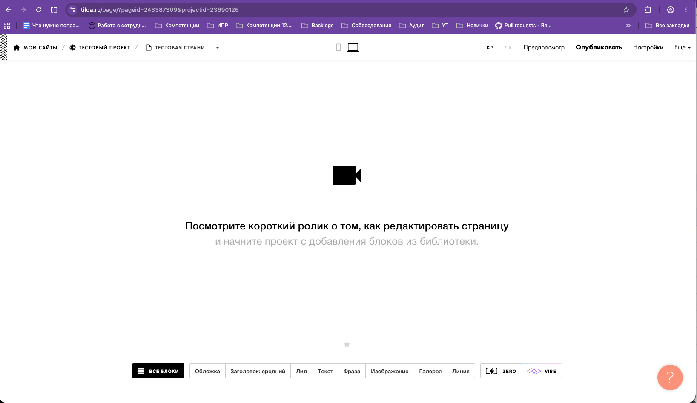

#### Скриншот 2. Список страниц проекта

На скриншоте показан выбранный проект и список страниц, доступных для редактирования.

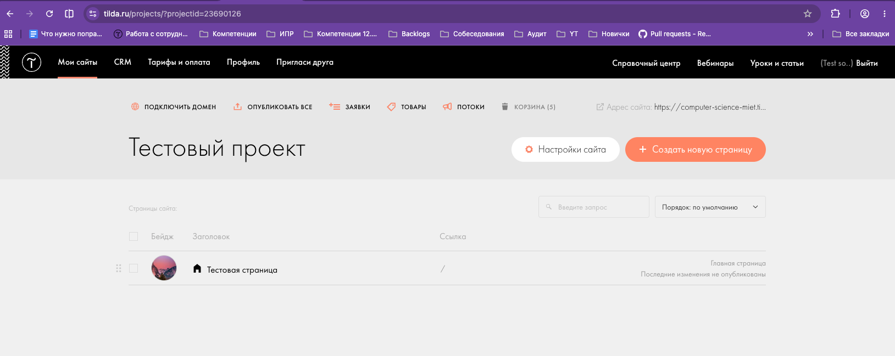

#### Скриншот 3. Редактор страницы

На скриншоте показана рабочая область редактора страницы до добавления нового блока.

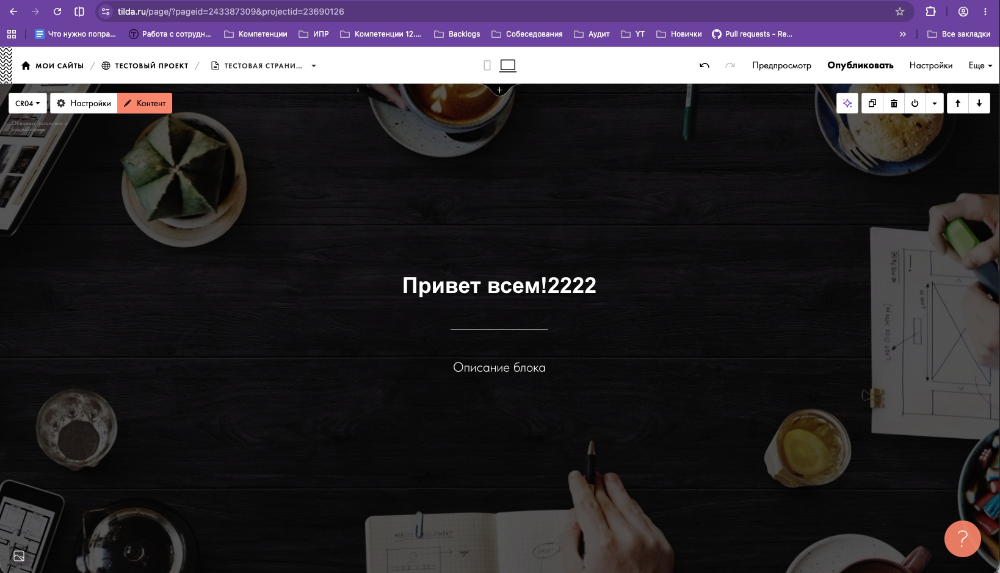

#### Скриншот 4. Библиотека готовых блоков

На скриншоте показана библиотека блоков и категории, по которым можно выполнить поиск нужного элемента.

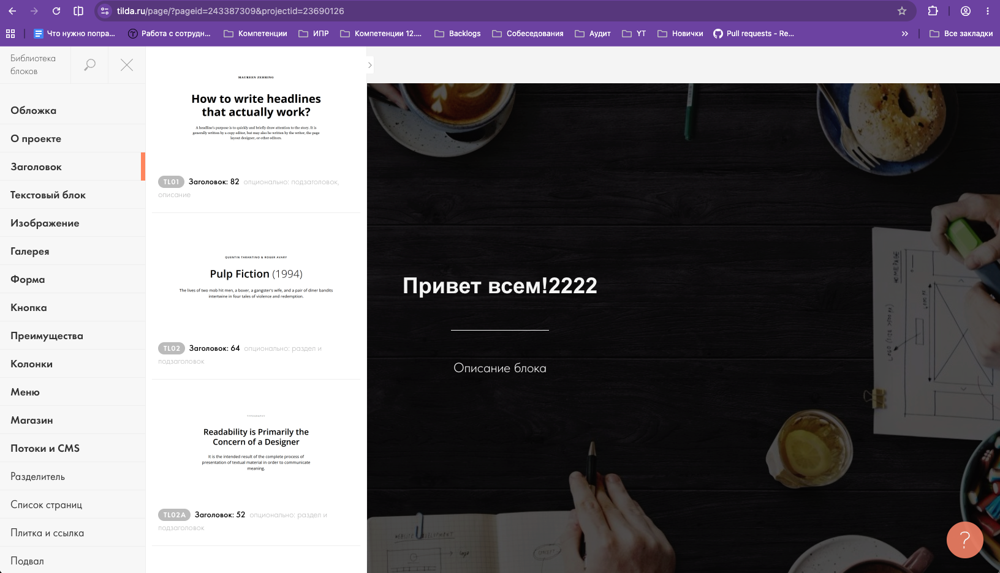

#### Скриншот 5. Добавленный блок

На скриншоте показан результат выполнения сценария — новый блок добавлен на страницу в редакторе.

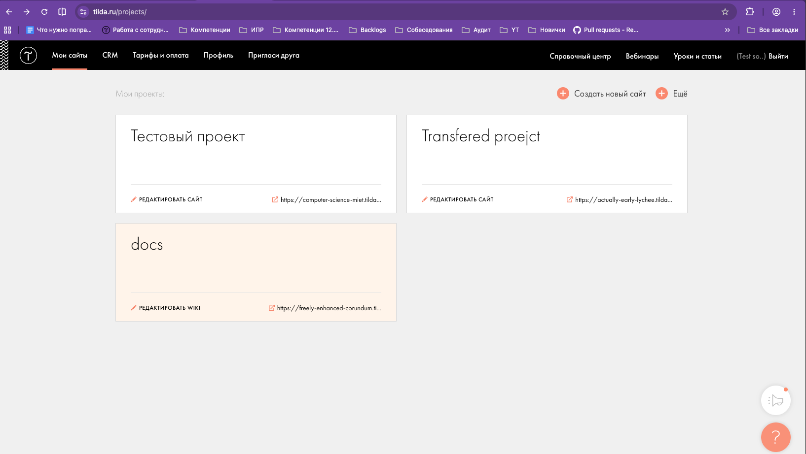

### 2.6. Вывод

В ходе анализа пользовательского интерфейса Tilda были определены основные страницы системы, ключевые элементы
управления и компоненты редактора.

Выбранный сценарий состоит из следующих основных этапов:

- переход в личный кабинет;
- выбор проекта;
- выбор страницы;
- открытие редактора;
- открытие библиотеки блоков;
- выбор готового блока;
- добавление блока на страницу;
- проверка результата.

Пользовательский интерфейс Tilda построен вокруг визуального редактора, который позволяет управлять содержимым страницы
с помощью готовых блоков. Для выполнения сценария пользователю не требуется самостоятельно писать HTML-код.

## 3. Анализ клиентской части

### 3.1. Исследование HTML-структуры

Для анализа был выбран элемент интерфейса «Все блоки» в редакторе Tilda.

Элемент используется для открытия библиотеки готовых блоков.

Основные характеристики элемента:

- HTML-тег: `
Все блоки
`
- CSS-классы: `tp-shortcuttools__one-item`, `tp-shortcuttools__one-item-title`, отвечающих за оформление и поведение
  элемента
- Текст элемента: «Все блоки»
- Вложенные элементы: текст "Все блоки" и иконка в формате svg

Скриншот HTML-структуры:

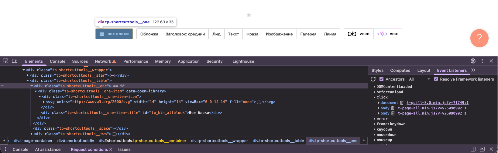

### 3.2. Исследование CSS

Для выбранного элемента были обнаружены CSS-классы, определяющие его внешний вид и положение на странице.

Основные свойства:

| Свойство     | Назначение                                      |
|--------------|-------------------------------------------------|
| `display`    | Определяет способ отображения элемента          |
| `padding`    | Задает внутренние отступы                       |
| `font-size`  | Определяет размер текста                        |
| `color`      | Определяет цвет текста                          |
| `background` | Определяет фон элемента                         |
| `cursor`     | Определяет вид курсора при наведении на элемент |

Скриншот CSS-стилей:

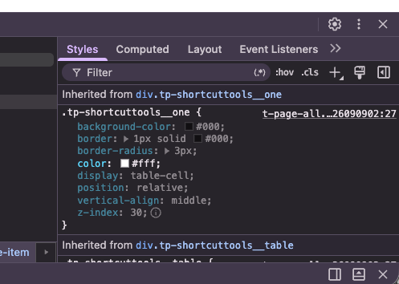

### 3.3. Исследование JavaScript

JavaScript используется для реализации интерактивного поведения редактора.

В разделе **Sources** были обнаружены JavaScript-файлы, загружаемые вместе со страницей.

JavaScript отвечает, в частности, за:

- обработку нажатий пользователя;
- открытие и закрытие элементов интерфейса;
- изменение содержимого страницы;
- взаимодействие с сервером;
- обновление интерфейса без полной перезагрузки страницы.

При нажатии на кнопку добавления блока интерфейс реагирует на действие пользователя и открывает библиотеку блоков.

Скриншот загруженных JavaScript-файлов:

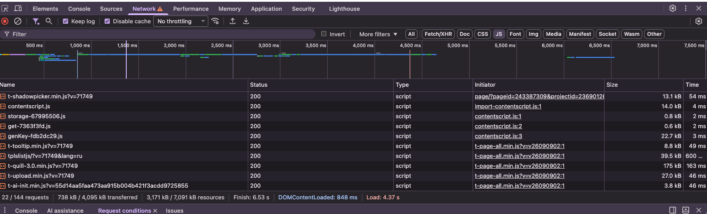

### 3.4. Загружаемые ресурсы

При открытии редактора браузер загружает различные ресурсы, необходимые для работы приложения.

Были обнаружены следующие типы ресурсов:

| Тип        | Пример            | Назначение                        |
|------------|-------------------|-----------------------------------|
| Document   | HTML-страница     | Загрузка страницы                 |
| Script     | JavaScript-файлы  | Работа клиентской логики          |
| Stylesheet | CSS-файлы         | Оформление интерфейса             |
| Image      | Изображения       | Отображение графических элементов |
| Font       | Шрифты            | Отображение текста                |
| Fetch/XHR  | Запросы к серверу | Обмен данными                     |

### 3.5. Анализ сетевых запросов

При открытии редактора браузер выполняет большое количество сетевых запросов.

Они используются для загрузки интерфейса, JavaScript, CSS, изображений и обмена данными с сервером.

Примеры обнаруженных запросов:

| Метод                                                                   | Тип        | Статус | Назначение               |
|-------------------------------------------------------------------------|------------|--------|--------------------------|
| GET /page/?pageid={id}&projectid={id}                                   | Document   | 200    | Загрузка страницы        |
| GET https://app.tildacdn.com/tfront/page-editor/t-page-all.min.js       | Script     | 200    | Загрузка JavaScript      |
| GET https://app.tildacdn.com/tfront/page-editor/t-page-edit-all.min.css | Stylesheet | 200    | Загрузка CSS             |
| POST /page/get/getpage/                                                 | Fetch/XHR  | 200    | Обмен данными с сервером |

### 3.6. Запрос при добавлении блока

При выполнении сценария «Добавление блока на страницу» в разделе Network были обнаружены дополнительные запросы.

Один из запросов был связан с получением или передачей данных, необходимых для работы редактора.

Основные параметры:

- Метод: `POST`
- Url: `/page/submit/`
- Тип: `Fetch/XHR`
- Статус: `200 OK`
- Данные запроса: идентификатор страницы и идентификатор шаблона из библиотеки блоков
- Ответ: данные, необходимые клиентской части для отображения добавленного блока (html)

Скриншот запроса:

### 3.7. Вывод

В ходе анализа клиентской части Tilda были изучены:

- HTML-структура элемента интерфейса;
- CSS-классы и основные стили;
- JavaScript-файлы и их роль в работе интерфейса;
- загружаемые ресурсы;
- сетевые запросы браузера.

Установлено, что клиентская часть отвечает за отображение редактора, обработку действий пользователя и взаимодействие с
сервером.

При добавлении блока пользователь выполняет действие в интерфейсе, JavaScript обрабатывает это действие, а клиентская
часть при необходимости выполняет сетевые запросы для получения или сохранения данных.

## 4. Анализ серверной части и API

### 4.1. Серверная часть

Серверная часть Tilda отвечает за операции, которые требуют обработки и хранения данных на сервере.

В рамках выбранного сценария «Добавление блока на страницу» можно предположить выполнение следующих серверных операций:

- получение данных проекта и страницы;
- получение данных о доступных блоках;
- сохранение изменений страницы;
- загрузка и получение необходимых ресурсов;
- проверка прав пользователя на работу с проектом.

Точная внутренняя реализация серверной части недоступна пользователю, поэтому часть выводов основана на наблюдаемых
сетевых запросах и поведении системы.

### 4.2. Передаваемые данные

При работе редактора между браузером и сервером передаются различные данные.

В зависимости от выполняемого действия это могут быть:

- идентификатор проекта;
- идентификатор страницы;
- данные выбранного блока;
- параметры блока;
- данные пользователя и его сессии;
- данные для сохранения изменений.

Например, при добавлении блока клиентская часть должна передать серверу информацию, необходимую для определения проекта,
страницы и выполняемого действия.

Часть этих данных может передаваться в параметрах URL, заголовках или теле HTTP-запроса.

### 4.3. API и сетевое взаимодействие

В разделе Network были обнаружены запросы типа `Fetch/XHR`.

Они используются клиентской частью для обмена данными с сервером.

Пример наблюдаемого запроса:

| Параметр   | Значение                                                  |
|------------|-----------------------------------------------------------|
| Метод      | POST                                                      |
| Тип        | Fetch/XHR                                                 |
| URL        | /page/submit/                                             |
| Статус     | 200 OK                                                    |
| Назначение | Передача данных между редактором и сервером               |
| Данные     | Идентификатор страницы, идентификатор блока из библиотеки |

API позволяет клиентской части отправлять данные на сервер и получать результат обработки.

Скриншот сетевого запроса:

### 4.4. Внешние сервисы

При работе Tilda браузер может обращаться не только к основному домену системы, но и к другим доменам.

Такие обращения могут использоваться для:

- загрузки шрифтов;
- загрузки изображений;
- аналитики;
- работы внешних интеграций;
- других дополнительных функций.

В ходе анализа были обнаружены следующие внешние домены:

| Домен               | Назначение                         |
|---------------------|------------------------------------|
| app.tildacdn.com    | Загрузка внешнего ресурса (js,css) |
| static.tildacdn.com | Загрузка изображений               |

Если назначение домена точно определить невозможно, необходимо указать это в отчете.

### 4.5. Хранилища данных

Внутренние хранилища Tilda непосредственно из браузера не видны.

Однако по функциям системы можно предположить наличие нескольких типов хранилищ:

| Хранилище            | Предполагаемое назначение                                     |
|----------------------|---------------------------------------------------------------|
| База данных          | Хранение пользователей, проектов, страниц и настроек          |
| Файловое хранилище   | Хранение изображений и других загруженных файлов              |
| Кэш                  | Быстрый доступ к часто используемым данным                    |
| Браузерное хранилище | Хранение части данных непосредственно на стороне пользователя |

Эти предположения основаны на функциональности системы. Точная технология хранения данных по результатам внешнего
анализа не определяется.

### 4.6. Общая схема взаимодействия

На основании проведенного анализа можно представить упрощенную схему работы системы:

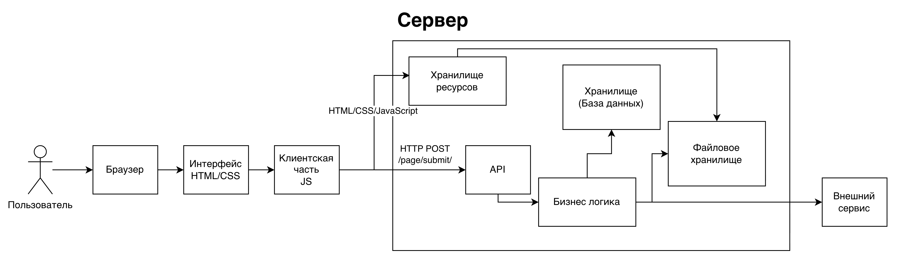

## 5. Описание пользовательского сценария

### 5.1. Выбранный сценарий

Название сценария: добавление блока на страницу в редакторе Tilda.

Цель сценария: добавить новый готовый блок на страницу проекта.

### 5.2. Последовательность выполнения сценария

#### Этап 1. Пользователь открывает страницу

Пользователь авторизуется в Tilda, выбирает проект и открывает страницу в редакторе.

На этом этапе браузер загружает необходимые HTML-, CSS- и JavaScript-ресурсы.

#### Этап 2. Пользователь открывает библиотеку блоков

Пользователь нажимает кнопку добавления нового блока.

JavaScript обрабатывает действие пользователя и открывает интерфейс библиотеки блоков.

#### Этап 3. Пользователь выбирает блок

Пользователь выбирает категорию и нужный готовый блок.

Клиентская часть определяет выбранный пользователем блок и подготавливает данные для его добавления.

#### Этап 4. Клиентская часть взаимодействует с сервером

При необходимости браузер отправляет запрос на сервер через API.

В запросе могут передаваться данные о проекте, странице, выбранном блоке и выполняемом действии.

#### Этап 5. Сервер обрабатывает запрос

Сервер принимает запрос и выполняет необходимые операции.

Предположительно, сервер проверяет доступ пользователя к проекту и обрабатывает данные страницы.

Если требуется сохранение изменений, данные записываются в соответствующее хранилище.

#### Этап 6. Сервер возвращает результат

После обработки сервер возвращает результат клиентской части.

Клиент получает необходимые данные и продолжает работу редактора.

#### Этап 7. Интерфейс отображает результат

JavaScript обрабатывает полученный результат и обновляет интерфейс.

Новый блок появляется в рабочей области редактора.

Пользователь видит результат своего действия.

### 5.3. Общая последовательность

Упрощенно сценарий можно представить следующим образом:
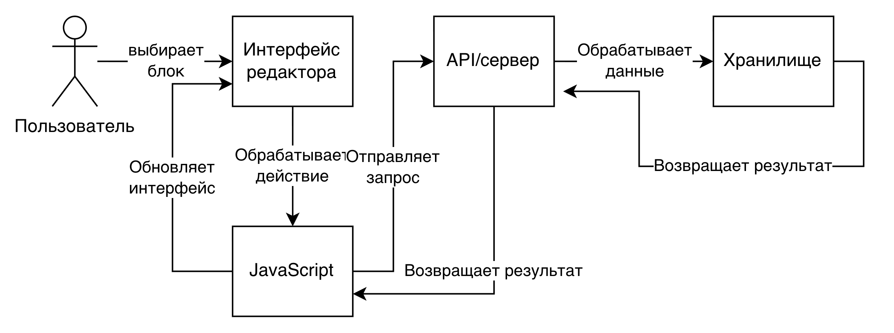

## 6. Построение архитектурной схемы

### 6.1. Архитектурная схема

Для демонстрационного варианта была построена упрощенная архитектурная схема информационной системы Tilda.

На схеме представлены основные компоненты:

- пользователь;
- браузер;
- пользовательский интерфейс;
- клиентская часть;
- API;
- серверная часть;
- хранилище данных;
- внешние сервисы.

Схема показывает направление взаимодействия между компонентами при выполнении сценария добавления блока на страницу.

### 6.2. Взаимодействие компонентов

Основные взаимодействия в системе:

1. Пользователь выполняет действия в интерфейсе Tilda.
2. Браузер отображает интерфейс и выполняет клиентский код.
3. Клиентская часть обрабатывает действия пользователя.
4. При необходимости клиентская часть отправляет запрос через API.
5. Сервер обрабатывает полученный запрос.
6. Сервер обращается к хранилищу данных.
7. Сервер возвращает результат клиентской части.
8. Клиентская часть обновляет интерфейс.
9. Пользователь видит результат выполненного действия.

Дополнительно серверная часть может взаимодействовать с внешними сервисами, необходимыми для работы отдельных функций
системы.

### 6.3. Архитектурная схема

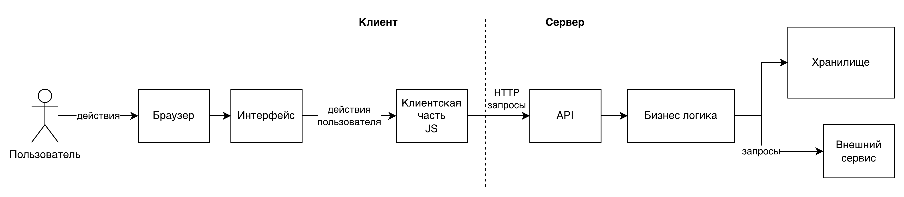