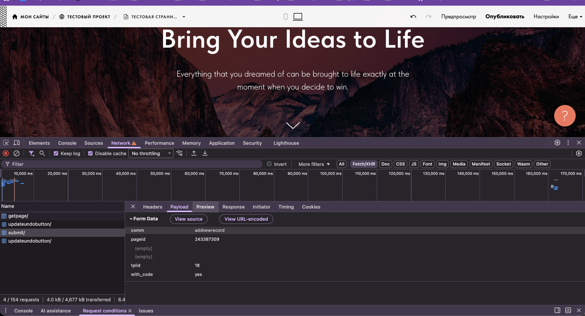
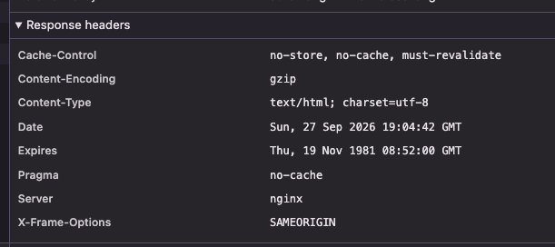
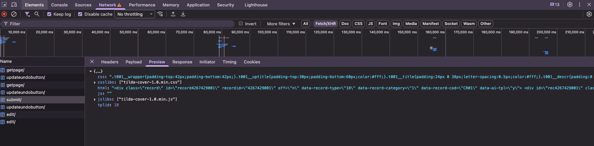
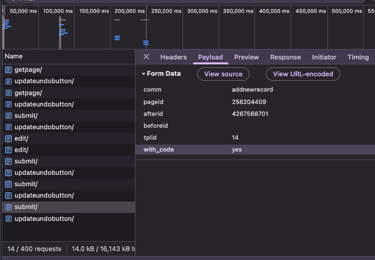
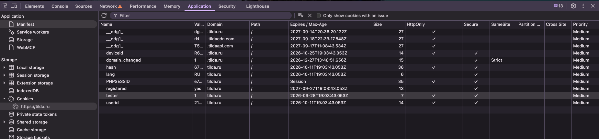
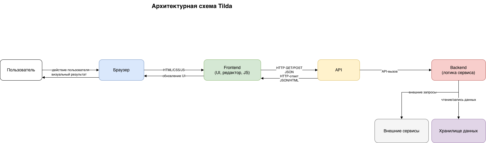
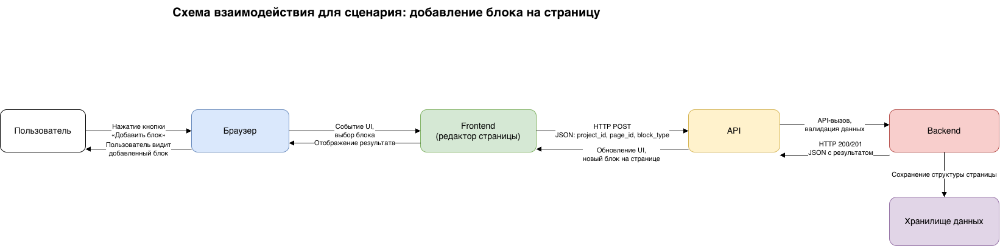

# Лабораторная работа №2

## Анализ веб-приложения и клиент-серверного взаимодействия

## 1. Исследуемая информационная система

Для выполнения лабораторной работы был выбран сервис Tilda и пользовательский сценарий: добавление блока на страницу в
редакторе.

Tilda — это облачный конструктор сайтов, позволяющий создавать и редактировать страницы без ручного написания полной
веб-структуры. Пользователь работает через веб-интерфейс, который формирует запросы к серверу, а сервер возвращает
данные и обновляет состояние страницы.

В ходе исследования были выделены следующие основные компоненты:

- браузер пользователя;
- интерфейс сайта (frontend);
- клиентский JavaScript, который управляет редактированием страницы;
- API-сервис, принимающий запросы от клиента;
- backend, реализующий обработку данных;
- хранилище данных, в котором сохраняются проекты, страницы и блоки;
- внешние сервисы и ресурсы (CDN, аналитика, авторизация, загрузка статических файлов).

### 1.1. Сценарий исследования

Исследуемый сценарий:

1. Авторизация в личном кабинете Tilda.
2. Открытие проекта и страницы.
3. Переход в редактор страницы.
4. Выбор пункта добавления блока.
5. Выбор подходящего блока из библиотеки.
6. Добавление блока на страницу.
7. Проверка визуального результата.


## 2. Анализ HTTP-запросов

В работе для изучения сетевого взаимодействия использовалась вкладка Network в браузерных DevTools. Перед началом
сценария список запросов был очищен, после чего были выполнены действия, связанные с добавлением блока на страницу. В
результате удалось наблюдать сетевые обращения, которые обеспечивали загрузку интерфейса, получение данных страницы и
передачу изменений на сервер.

### 2.1. Основные наблюдения

Во время исследования были замечены следующие типы HTTP-запросов:

- GET-запросы для загрузки HTML, CSS, JavaScript и изображений;
- POST-запросы для отправки данных на сервер после действия пользователя;
- запросы на получение/обновление данных страницы и структуры проекта;
- служебные запросы, связанные с сессией, авторизацией и аналитикой.

### 2.2. Таблица HTTP-запросов

Ниже приведены типичные запросы, обнаруженные в ходе исследования. Для безопасности и корректности отчета реальные
значения cookies, токены и идентификаторы не приводятся, а вместо них указаны типы и назначение данных.

| № | Метод | URL / тип запроса                                             | Статус | Назначение                                                    |
|---|-------|---------------------------------------------------------------|--------|---------------------------------------------------------------|
| 1 | GET   | /page/?pageid={id}                                            | 200    | Загрузка страницы редактора                                   |
| 2 | GET   | https://app.tildacdn.com/tfront/page-editor/t-page-all.min.js | 200    | Загрузка JavaScript frontend                                  |
| 3 | GET   | /page/tplslistjs/?v=79148&lang=ru                             | 200    | Загрузка списка блоков в библиотеке                           |
| 4 | GET   | https://static.tildacdn.com/lib/tscripts/tplicons/tpl_18.png  | 200    | Загрузка изображения шаблона блока                            |
| 5 | POST  | /page/get/getpage/                                            | 200    | Получение данных структуры страницы                           |
| 6 | POST  | /page/submit/                                                 | 200    | Добавление блока в страницу                                   |
| 7 | POST  | /page/edit/                                                   | 200    | Получение данных блока для редактирования изменений редактора |
| 8 | POST  | /page/submit/updateundobutton/                                | 200    | Служебный аналитический запрос                                |

### 2.3. Запросы, относящиеся к пользовательскому сценарию

К выбранному сценарию относятся те запросы, которые были запущены после нажатия на кнопку добавления блока. В частности,
после активации элемента интерфейса браузер инициировал запрос на получение или обновление структуры страницы. Это
подтверждает, что интерфейс работает не локально, а через сетевой обмен данными с сервером.

Наблюдаемый факт: после действия «Добавить блок» в DevTools появился HTTP POST-запрос, который связан с обновлением
структуры страницы.

Предположение: запрос обрабатывается API-сервисом, который затем сохраняет изменения и возвращает обновленную модель
страницы.



## 3. Анализ HTTP-ответов

После выполнения запроса сервер возвращает HTTP-ответ, в котором содержатся статус-код, заголовки и тело ответа. Для
анализа были выбраны два запроса: один на загрузку страницы редактора и один на добавление блока.

### 3.1. Пример анализа ответа на запрос страницы

Для запроса загрузки страницы редактора был получен ответ со статусом 200 OK. Это указывает на успешную загрузку
страницы, после чего браузер начал рендерить интерфейс.

Основные наблюдаемые заголовки:

- Content-Type: text/html или application/json;
- Cache-Control: политика кэширования содержимого;
- Expires: политика кэширования содержимого;
- Date: дата и время ответа;
- Server: название серверного программного обеспечения (если было видно в заголовках);

Тело ответа представляло HTML-страницу или данные страницы, необходимые для инициализации редактора.

### 3.2. Пример анализа ответа на запрос добавления блока

Для API-запроса, связанного с добавлением блока, был получен ответ со статусом 200 или 201, что соответствует успешной
операции. Это означает, что сервер подтвердил выполнение действия и передал результат в формате JSON.


Пример структуры ответа:

```json
{
  "css": ".t001__wrapper{padding-top:42px;padding-bottom:42px;}*****",
  "csslibs": [
    "tilda-cover-1.0.min.css"
  ],
  "html": "<div class=\"record\" id=\"record4267429001\" recordid=\"4267429001\" off=\"n\" data-record-type=\"18\" data-record-category=\"1\" data-record-cod=\"CR01\" data-ai-tpl=\"y\"> ****",
  "js": "",
  "jslibs": [
    "tilda-cover-1.0.min.js"
  ],
  "tplid": 18
}
```

В ответе были найдены данные о добавленном блоке, в том числе его css и его html представление. Браузер
получал эти данные и обновлял интерфейс, добавляя блок в рабочую область редактора.

### 3.3. Наблюдаемые факты и предположения

Наблюдаемый факт: сервер возвращает JSON-ответ после добавления блока.

Предположение: backend выполняет валидацию данных, сохраняет новое состояние страницы и возвращает результат клиенту.

Предположение: часть логики может быть вынесена в отдельный API-сервис, но это нельзя установить напрямую без доступа к
серверной реализации.



## 4. Анализ параметров и передаваемых данных

При выполнении пользовательского сценария браузер передавал серверу информацию, которая позволяла понять, какой объект
редактируется и какое действие нужно выполнить.

### 4.1. Параметры запроса

В запросах, связанных с добавлением блока, можно было выделить следующие типы параметров:

В теле запроса:

- команда действия (например, addnewrecord);
- идентификатор страницы;
- идентификатор шаблона блока из библиотеки;

В заголовках:

- время операции;
- версия браузера;
- кодировка браузера;
- Content-type (тип передаваемых данных);
- идентификатор сессии (внутри cookie).

### 4.2. Где находятся данные

Параметры были расположены следующим образом:

- часть данных — в URL-параметрах query string;
- основная часть данных — в теле HTTP-запроса (payload);
- служебные данные — в cookie и заголовках запроса.

Пример структуры данных в body запроса:

```
comm=addnewrecord
pageid=258204409
tplid=18
afterid=4267568701
beforeid=
with_code=
```

### 4.3. Какие данные передаются при добавлении блока

При добавлении блока на страницу сервер получает:

- какая страница редактируется;
- какой тип блока выбран пользователем;
- в каком месте страницы его нужно разместить;
- когда операция была выполнена.

В ответе сервер возвращал результат операции и обновленные данные блока, чтобы пользователь видел измененное
состояние без перезагрузки страницы.



## 5. Анализ cookies

Cookies используются в веб-приложениях для хранения небольших данных, которые браузер должен отправлять серверу при
последующих запросах. В Tilda это может использоваться для авторизации, идентификации сессии, аналитики и хранения
пользовательских настроек.

### 5.1. Что было обнаружено

Для исследуемого сайта были просмотрены cookies через вкладку Application / Storage. Пример структуры cookie:

| Имя cookie | Домен     | Срок действия                       | Назначение                                     | Флаги                      | Комментарий                                                                                 |
|------------|-----------|-------------------------------------|------------------------------------------------|----------------------------|---------------------------------------------------------------------------------------------|
| PHPSESSID  | .tilda.ru | сессия                              | идентификация сессии пользователя              | Secure, HttpOnly, SameSite | предположение, что используется для авторизации                                             |
| registered | .tilda.ru | длительный срок                     | идентификация зарегистрированного пользователя | Secure                     | предположение, что используется для различия зарегистрированного и анонимного пользователей |
| __ddg1_    | .tilda.ru | длительный срок                     | аналитика                                      | Secure, SameSite           | наблюдаемый факт: cookie используется для аналитики                                         |
| lang       | .tilda.ru | срок действия, заданный приложением | языковые настройки                             | SameSite                   | предположение, что используется для локализации                                             |

### 5.2. Анализ результатов

Наблюдаемый факт: на сайте используются cookies, которые отправляются вместе с запросами к домену сервиса.

Предположение: часть cookies отвечает за авторизацию и сессию, часть — за аналитику и настройки интерфейса.

Если назначение cookie нельзя установить точно, это отмечено как предположение, а не как факт.



## 6. Взаимодействие Frontend, API и Backend

Для выбранного пользовательского сценария важным является понимание цепочки событий от действия пользователя до
визуального обновления интерфейса.

### 6.1. Последовательность событий

- Пользователь
- Интерфейс редактора
- JavaScript / frontend-логика
- HTTP-запрос к API
- Backend-сервис
- Обработка и сохранение данных
- HTTP-ответ
- Обновление интерфейса
- Пользователь видит новый блок на странице

### 6.2. Конкретное действие

Рассмотрим действие: пользователь нажимает кнопку добавления блока, выбирает блок и подтверждает добавление.

1. Пользователь взаимодействует с UI-элементом редактора (`.tp-library__tpl-body`).
2. Frontend реагирует на действие и формирует HTTP-запрос.
3. Браузер отправляет запрос на API-адрес (`POST /page/submit/`).
4. API принимает запрос и шлёт его на backend.
5. Backend обрабатывает данные: проверяет права, формирует объект блока и сохраняет его в структуре страницы.
6. Сервер возвращает ответ со статусом успеха (html блока, его идентификатор).
7. JavaScript frontend получает ответ и обновляет визуальную структуру страницы - вставляет новый блок в место добавления.
8. Пользователь видит добавленный блок в рабочей области редактора.

### 6.3. Вывод по архитектуре

В результате исследования было подтверждено, что взаимодействие между клиентом и сервером происходит через HTTP. Браузер
не хранит состояние страницы в единственном локальном файле; он получает и отправляет данные через API, что позволяет
приложению обновлять интерфейс динамически, без полной перезагрузки страницы.


## 7. Сопоставление с архитектурой из лабораторной работы №1

По результатам первой лабораторной работы была построена предварительная архитектурная схема системы. Во второй
лабораторной она была сопоставлена с реальным сетевым поведением приложения.

### 7.1. Что удалось подтвердить

Были подтверждены следующие элементы архитектуры:

- браузер пользователя является входной точкой взаимодействия;
- frontend загружает интерфейс, обрабатывает действия пользователя и формирует HTTP-запросы;
- API участвует в обмене данными между клиентом и сервером;
- backend отвечает за обработку запросов и обновление состояния страницы;
- данные сохраняются в хранилище данных, а не только в памяти браузера;
- cookies используются для поддержания пользовательской сессии и некоторой служебной информации.

### 7.2. Что остается предположительным

Некоторые элементы архитектуры не были видны напрямую из DevTools, поэтому они остаются предположениями:

- какая именно база данных используется на сервере;
- на каком языке реализован backend;
- используется ли отдельный API gateway;
- какая часть обработки вынесена во внешние сервисы;
- есть ли кеширование на стороне сервера или CDN.

### 7.3. Дополнение архитектурной схемы

После исследования стало понятно, что взаимодействие идет по следующей схеме:
- Пользователь
- Браузер
- Frontend
- API
- Backend
- Хранилище данных

и при необходимости возможно присутствие внешних сервисов для аналитики, CDN и авторизации.



## 8. Схема взаимодействия компонентов

На основании проведенного анализа была построена отдельная схема взаимодействия компонентов для сценария добавления
блока.




На схеме отражены:

- пользователь;
- браузер;
- frontend;
- API;
- backend;
- хранилище данных;
- направления обмена данными;
- HTTP-запросы и HTTP-ответы;
- JSON-передача данных;
- обновление интерфейса после ответа сервера.


## 9. Вывод

В ходе лабораторной работы было проведено исследование HTTP-взаимодействия в веб-приложении Tilda на выбранном сценарии
«добавление блока на страницу». Было установлено, что интерфейс работает через клиентский JavaScript, который отправляет
HTTP-запросы к серверу, а сервер отвечает данными и статусами выполнения операции.

Были выявлены следующие важные результаты:

- браузер и frontend тесно взаимодействуют для обработки пользовательского действия;
- запросы к API выполняются при загрузке страницы и при изменении ее структуры;
- добавление блока сопровождается HTTP POST-запросом и ответом сервера;
- данные передаются в URL и в теле запроса, а также хранятся в cookies;
- обратно пользователю приходит результат, который обновляет интерфейс без полной перезагрузки страницы.

Главный вывод состоит в том, что современное веб-приложение является распределенной системой: пользователь
взаимодействует с UI, frontend формирует сеть запросов, API организует обмен данными, а backend обрабатывает их и
сохраняет состояние. Важным является также разделение фактов и предположений: факты подтверждены в DevTools, а
предположения обозначены как гипотезы, поскольку без доступа к серверной части нельзя установить внутреннюю реализацию с
абсолютной уверенностью.

### 9.1. Результаты работы

- Подтверждено: наличие HTTP-запросов при работе с редактором страницы.
- Подтверждено: наличие API-взаимодействия между frontend и backend.
- Подтверждено: использование cookies и заголовков HTTP для поддержания сессии и передачи данных.
- Подтверждено: обновление интерфейса после получения ответа сервера.
- Предположительно: конкретная реализация backend и структура внутренних сервисов.

В результате лабораторная работа была оформлена в виде отчета с описанием сетевого взаимодействия, таблицами запросов,
анализом параметров и cookies, а также архитектурной схемой сценария.
