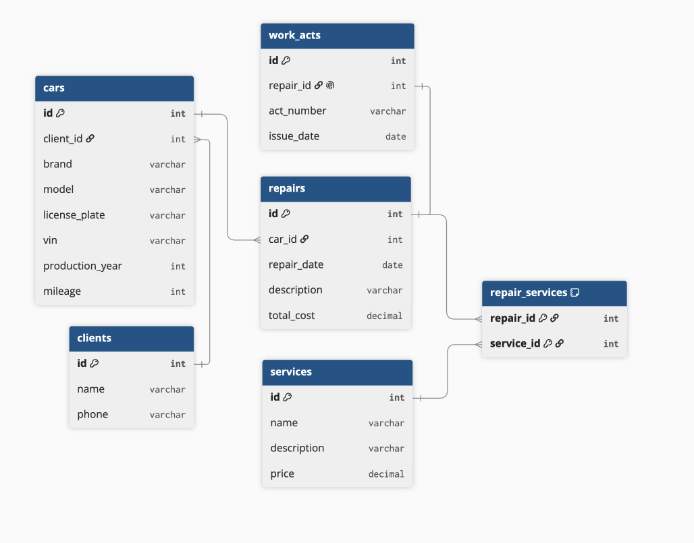

# Анализ и моделирование данных предметной области

## 1. Описание предметной области

Предметная область: автомастерская.

Автомастерская занимается техническим обслуживанием и ремонтом автомобилей клиентов.

Основные процессы:
- прием автомобиля клиента;
- проведение технического обслуживания и ремонта;
- выполнение необходимых услуг;
- хранение информации об автомобилях клиентов;
- сохранение истории выполненных ремонтов;
- оформление результатов выполненного ремонта.

Пользователи системы:
- клиенты автомастерской;
- сотрудники автомастерской.

Основные задачи информационной системы:
- хранение информации о клиентах;
- хранение информации об автомобилях клиентов;
- учет выполненных ремонтов;
- хранение перечня услуг автомастерской;
- учет услуг, выполненных в рамках ремонта;
- хранение информации об оформленных актах выполненных работ;
- просмотр истории ремонтов автомобиля.

## 2. Объекты данных

В предметной области выделены следующие основные объекты данных.

### Клиент

Клиент автомастерской, которому принадлежит один или несколько автомобилей.

Необходимо хранить:
- идентификатор клиента;
- имя;
- номер телефона.

### Автомобиль

Автомобиль клиента, который обслуживается в автомастерской.

Необходимо хранить:
- идентификатор автомобиля;
- идентификатор владельца;
- марку;
- модель;
- государственный номер;
- VIN;
- год выпуска;
- пробег.

### Ремонт

Информация о выполненном ремонте или техническом обслуживании автомобиля.

Необходимо хранить:
- идентификатор ремонта;
- идентификатор автомобиля;
- дату ремонта;
- описание выполненных работ;
- общую стоимость.

### Услуга

Услуга, которую автомастерская может выполнить в рамках ремонта автомобиля.

Необходимо хранить:
- идентификатор услуги;
- название;
- описание;
- стоимость.

### Акт выполненных работ

Документ, оформляемый по результатам выполненного ремонта.

Необходимо хранить:
- идентификатор акта;
- идентификатор ремонта;
- номер акта;
- дату оформления.

## 3. Атрибуты объектов

Для каждого объекта были определены основные атрибуты и предполагаемые типы данных.

### Клиент

| Атрибут | Тип данных | Описание |
|---|---|---|
| id | Число | Уникальный идентификатор клиента |
| имя | Строка | Имя клиента |
| телефон | Строка | Номер телефона клиента |

### Автомобиль

| Атрибут | Тип данных | Описание |
|---|---|---|
| id | Число | Уникальный идентификатор автомобиля |
| client_id | Число | Идентификатор владельца автомобиля |
| марка | Строка | Марка автомобиля |
| модель | Строка | Модель автомобиля |
| госномер | Строка | Государственный регистрационный номер |
| VIN | Строка | Идентификационный номер автомобиля |
| год выпуска | Число | Год выпуска автомобиля |
| пробег | Число | Пробег автомобиля |

### Ремонт

| Атрибут | Тип данных | Описание |
|---|---|---|
| id | Число | Уникальный идентификатор ремонта |
| car_id | Число | Идентификатор автомобиля |
| дата | Дата | Дата проведения ремонта |
| описание | Строка | Описание выполненных работ |
| стоимость | Число | Общая стоимость ремонта |

### Услуга

| Атрибут | Тип данных | Описание |
|---|---|---|
| id | Число | Уникальный идентификатор услуги |
| название | Строка | Название услуги |
| описание | Строка | Описание услуги |
| стоимость | Число | Стоимость услуги |

### Акт выполненных работ

| Атрибут | Тип данных | Описание |
|---|---|---|
| id | Число | Уникальный идентификатор акта |
| repair_id | Число | Идентификатор ремонта |
| номер | Строка | Номер акта выполненных работ |
| дата оформления | Дата | Дата оформления акта |

## 4. Классификация данных

Выделенные данные можно классифицировать по их назначению и типу.

| Категория данных | Примеры | Назначение |
|---|---|---|
| Текстовые | имя клиента, телефон, марка, модель, госномер, VIN, название услуги, описание работ | Хранение текстовой информации об объектах |
| Числовые | идентификаторы, год выпуска, пробег, стоимость | Хранение числовых значений |
| Даты и время | дата ремонта, дата оформления акта | Хранение информации о датах событий |
| Логические | отсутствуют в текущей модели | В текущей модели данные типа «да/нет» не используются |
| Справочные | услуги автомастерской | Хранение перечня доступных услуг |
| Вычисляемые | общая стоимость ремонта | Значение может быть рассчитано на основе стоимости выполненных услуг |

## 5. Связи между объектами

Между объектами предметной области были определены следующие связи.

### Клиент - Автомобиль

Тип связи: один ко многим (1:N).

Один клиент может владеть несколькими автомобилями. Каждый автомобиль принадлежит одному клиенту.

### Автомобиль - Ремонт

Тип связи: один ко многим (1:N).

Один автомобиль может иметь несколько ремонтов. Каждый ремонт относится к одному автомобилю.

### Ремонт - Акт выполненных работ

Тип связи: один к одному (1:1).

По результатам одного ремонта оформляется один акт выполненных работ. Каждый акт относится к одному конкретному ремонту.

### Ремонт - Услуга

Тип связи: многие ко многим (M:N).

В рамках одного ремонта может быть выполнено несколько услуг. Одна и та же услуга может выполняться в рамках разных ремонтов.
Для реализации связи многие ко многим используется промежуточная таблица «Ремонт_Услуга», которая содержит идентификатор ремонта и идентификатор услуги.

## 6. Концептуальная модель данных

На схеме отражены следующие связи:

- Клиент 1:N Автомобиль;
- Автомобиль 1:N Ремонт;
- Ремонт 1:1 Акт выполненных работ;
- Ремонт M:N Услуга.

Связь многие ко многим между ремонтом и услугой реализована с помощью промежуточной таблицы «Ремонт_Услуга».

### Схема концептуальной модели

На схеме отражены следующие связи:

- Клиент 1:N Автомобиль;
- Автомобиль 1:N Ремонт;
- Ремонт 1:1 Акт выполненных работ;
- Ремонт M:N Услуга.

## 7. Оценка качества исходных данных

После построения концептуальной модели была выполнена оценка полноты и качества данных.

### Достаточно ли объектов выделено?

Да. Выделенные объекты описывают основные данные, необходимые для учета клиентов, автомобилей, ремонтов, услуг и результатов выполненных работ.

### Отсутствуют ли важные сущности?

Для рассматриваемой модели основных сущностей достаточно. При дальнейшем развитии системы могут быть добавлены мастера, запасные части, платежи и другие объекты.

### Все ли необходимые атрибуты определены?

Для построения концептуальной модели определены основные атрибуты каждого объекта. При реализации реальной информационной системы набор атрибутов может быть расширен.

### Имеются ли дублирующиеся данные?

Явного дублирования данных в модели нет. Информация о клиентах, автомобилях, ремонтах, услугах и актах хранится в отдельных объектах и связывается между собой.

### Достаточно ли информации для дальнейшего проектирования информационной системы?

Да. Выделены основные объекты, их атрибуты и связи. Полученная модель может использоваться как основа для дальнейшего проектирования базы данных.

## Вывод

В ходе лабораторной работы была проанализирована предметная область автомастерской. Были выделены основные объекты данных, определены их атрибуты и выполнена классификация данных.

Между объектами были определены связи один к одному, один ко многим и многие ко многим. На основе проведенного анализа была построена концептуальная модель данных.

Полученная модель описывает основные данные автомастерской и может использоваться как основа для дальнейшего проектирования информационной системы.